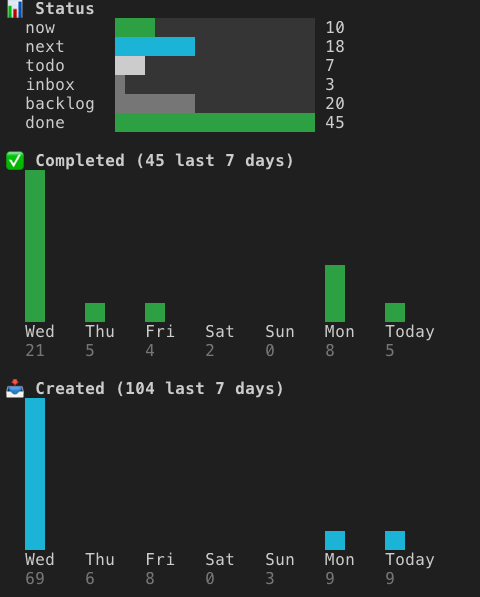

<div align="center">

# tk

**A terminal-first task manager backed by markdown files.**

*One command. All your tasks, from inbox to done.*

</div>

Tasks as plain `.md` files with YAML frontmatter — readable in the CLI, Obsidian, and any text editor. No database, no sync, just files you can git track.

- **Quick capture** — `tk add "thing"` drops it in inbox, `--now` or `--next` to skip ahead
- **GTD status flow** — `inbox → todo → next → now → done` with `backlog` for someday items
- **Projects** — group tasks under initiatives, batch edit in your editor, track on dashboard
- **Board view** — `tk board` opens your entire pipeline in `$EDITOR` for fast reorganization
- **Due dates** — `tk add "ship it" --due 5` surfaces tasks automatically when deadlines approach
- **Goals & focus** — track deadlines with progress bars, keep top-of-mind items visible
- **Interactive picker** — fzf-powered loop to process tasks without re-running commands
- **Dashboard** — bare `tk` shows focus, goals, active projects, and today's tasks
- **Agent-friendly** — `--json` output on every list command

---

## Install

Requires Go 1.21+ and [fzf](https://github.com/junegunn/fzf).

```sh
git clone https://github.com/nickhudkins/tk
cd tk
make install
```

Config at `~/.config/tk/config.yaml`:

```yaml
root: ~/path/to/your/tasks
focus_items: 3
due_soon_days: 3
```

## Quick Start

```sh
tk add "fix auth redirect loop"
tk add "ship v2" --due 14 --tags api
tk
```

## Status Flow

```
inbox  →  todo  →  next  →  now  →  done
            ↕                         ↕
         backlog                  archived
```

`tk now <id>` / `tk next <id>` set status directly. `tk done <id>` marks done. `tk backlog <id>` parks for later.

## Commands

### Tasks

```sh
tk add "title"                  # capture to inbox
tk add "title" --due 5          # due in 5 days
tk add "title" --due 2026-03-15 # due on specific date
tk add "title" --now --tags cli # add to now with tags
tk add "title" -P my-project    # add to a project
tk show 42                      # view task details
tk edit 42                      # open in $EDITOR
tk edit 42 -s next --due 3      # set status + due without editor
tk edit 42 -P my-project        # assign to project
tk copy 42                      # copy file path to clipboard
tk delete 42                    # delete permanently
```

### Status & Priority

```sh
tk now 42                       # set to now (w)
tk next 42                      # set to next (n)
tk backlog 42                   # park for later (bl)
tk done 42                      # mark done (d)
tk archive 42                   # shelve task
tk p0 42                        # set priority (p0/p1/p2)
```

### Views

```sh
tk list                         # all active tasks (ls)
tk list --due                   # tasks with due dates, nearest first
tk list --status next           # filter by status
tk list -P my-project           # filter by project
tk list --stale                 # stale tasks
tk list --sort priority --desc  # sort options: id|created|updated|title|status|priority
tk list --backlog               # backlog tasks
tk now                          # show now tasks (w)
tk next                         # show next tasks (n)
tk backlog                      # show backlog tasks (bl)
tk stats                        # status breakdown + trends
tk actions                      # next action per task (v)
tk search "auth"                # search by title/body (s)
tk export                       # markdown overview
```

### Interactive

```sh
tk pick                         # fzf picker with actions (i)
tk pick -P my-project           # pick within a project
tk plan                         # multi-select → move to now
tk board                        # edit all tasks in board view (b)
```

### Organize

```sh
tk focus                        # show focus items (f)
tk focus edit                   # edit .focus.md
tk goals                        # show goals (g)
tk goals edit                   # edit .goals.yaml
tk tags                         # list tags with counts
tk tags add 42 code             # tag a task
tk review                       # review stale + backlog tasks
tk project                      # list projects (proj, pr)
tk project add slug Title       # create a project
tk project slug                 # show project tasks by status
tk project edit                 # batch edit project tasks in $EDITOR
tk project status               # set project status via fzf
```

### Flags

| Flag | Description |
|------|-------------|
| `--json` | Structured output |
| `--due` | Filter to tasks with due dates |
| `--inbox` | Inbox only |
| `--all` | Include done/archived |
| `--stale` | Stale tasks only |
| `--status <s>` | Filter by status |
| `--sort <field>` | Sort by id, created, updated, title, status, priority |
| `--desc` | Reverse sort |
| `--show-updated` | Show relative update age |
| `-P, --project <slug>` | Filter by project (add, edit, list, pick) |

## Dashboard

Bare `tk` shows your daily view:

```
Focus
  - Ship small, ship often

Goals
  Ship v2 API          12/20 endpoints   ████████░░░░  18 days to go
  Launch blog                                           3 days to go

Active Projects
  website-redesign     Website Redesign  (2 now, 3 next, 4 todo)

Due Soon
  1. #42 [todo] Fix auth bug p0 #api     due tomorrow

Now (Mon Feb 24)
  1. #51 Review open PR  ‹website-redesign›
  2. #60 Deploy staging

Inbox: 3  Todo: 12  Next: 4  Now: 2  Done: 28
```

## Interactive Picker

`tk pick` opens an fzf picker that **loops** — process your whole list without re-running commands.

| Key | Action |
|-----|--------|
| `Enter` | Edit in $EDITOR |
| `Tab` | Multi-select |
| `Ctrl-E` | Set status (opens picker) |
| `Ctrl-D` | Mark done |
| `Ctrl-O` | Archive |
| `Ctrl-B` | Move to backlog |
| `Ctrl-X` | Delete |
| `Ctrl-R` | Set priority |
| `Ctrl-T` | Add tag |
| `Ctrl-P` | Assign to project |
| `Ctrl-F` | Cycle status filter |
| `Ctrl-G` | Cycle tag filter |
| `Esc` | Exit |

## Stats

`tk stats` shows status distribution, completion and creation trends over the last 7 days, and health metrics.



Use `--days 14` to extend the trend window.

## Projects

Group related tasks under a project. Projects have their own status: `todo → next → done`.

```sh
tk project add website-redesign Website Redesign --next
tk add "Fix auth" -P website-redesign --now
tk project website-redesign          # view tasks by status bucket
tk project edit website-redesign     # batch edit in $EDITOR
tk project edit                      # fzf pick project, then edit
tk project status                    # fzf pick project + status
```

Projects with status `next` appear on the dashboard. Tasks show their project as `‹slug›` in list views.

Project tasks are stored in `.projects.yaml`:

```yaml
- slug: website-redesign
  title: Website Redesign
  status: next
```

## Board

`tk board` (alias `b`) opens all active tasks in `$EDITOR` organized by status:

```markdown
# tk board

### now
- [42] Fix auth endpoint #api p0  ‹website-redesign›

### next
- [43] Write API docs  ‹website-redesign›

### todo
- [44] SEO audit

### inbox
### backlog
### done
### delete
```

Move lines between sections to change status. Add new lines to create tasks. Move to `### delete` to permanently remove. Save and quit — tk diffs and applies changes.

## Task Format

Each task lives at `<root>/NNN.md`:

```markdown
---
id: 42
title: Fix sidebar toggle bug
status: todo
priority: p0
tags: [code, chromium]
due: 2026-03-15
project: website-redesign
created: 2026-02-23T10:30:00-08:00
updated: 2026-02-23T10:30:00-08:00
---

Notes, links, whatever you want here.

- [ ] Write the migration script
- [x] Test with staging data
- [ ] Deploy to production
```

## Goals

Track deadlines and measurable progress in `.goals.yaml`:

```yaml
- title: Ship v2 API
  deadline: 2026-03-15
  metric: endpoints
  current: 12
  target: 20
- title: Launch blog
  deadline: 2026-03-01
```

Edit with `tk goals edit`. Shows on dashboard with progress bars and countdown.

## Config

`~/.config/tk/config.yaml`:

| Key | Default | Description |
|-----|---------|-------------|
| `root` | — | Task storage directory |
| `editor` | `nvim` | Editor for `tk edit` |
| `focus_items` | `3` | Number of focus items shown |
| `due_soon_days` | `3` | Days before due date to surface on dashboard |
| `stale_warn_days` | `28` | Days before stale warning |
| `stale_critical_days` | `56` | Days before critical stale warning |
| `demo` | `false` | Hide dashboard content |

---

> Personal tool built for my own workflow. Feel free to fork and adapt.
